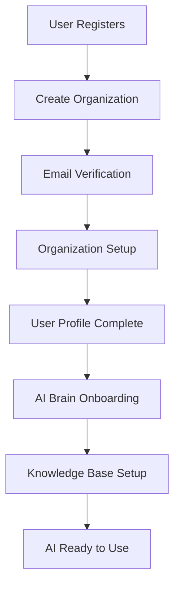

# 🧠 AI BRAIN - МАКСИМАЛЬНО ДЕТАЛЬНАЯ РЕАЛИЗАЦИЯ
## Полная пошаговая инструкция на основе PDF анализа

---

## 📊 CURRENT STATE ANALYSIS

### ✅ ЧТО УЖЕ РЕАЛИЗОВАНО:

1. **AI Module Structure:**
   ```
   backend/src/ai/
   ├── ai.module.ts
   ├── controllers/ai.controller.ts
   ├── services/ai.service.ts
   └── dto/ai-config.dto.ts
   ```

2. **Knowledge Management (частично):**
   ```
   backend/src/domains/ai-intelligence/knowledge-management/
   ├── knowledge-management.module.ts
   ├── infrastructure/controllers/knowledge-management.controller.ts
   ├── infrastructure/external-services/website-scraping.service.ts
   └── infrastructure/persistence/knowledge-document.entity.ts
   ```

3. **Основные функции AI:**
   - ✅ User Assistant configuration (personality, expertise)
   - ✅ Organization AI Brain (business goals, modules)
   - ✅ Vertex AI Gemini 2.5 integration (Flash/Pro)
   - ✅ Business Functions (createContact, scheduleMeeting)
   - ✅ Kazakhstan context (KZT, БИН, RU/KZ/EN)

4. **Database Entities:**
   - ✅ KnowledgeDocumentEntity
   - ✅ DocumentChunkEntity
   - ✅ User.aiConfig
   - ✅ Organization.aiBrain

### ❌ ЧТО НУЖНО ДОРАБОТАТЬ:

1. **Полный RAG Pipeline** - только структура, нет реализации
2. **Multi-tenant Knowledge Base** - нет фильтрации по organizationId
3. **Function Calling Execution** - только определения функций
4. **pgvector Integration** - не настроен
5. **File Upload Processing** - не реализован
6. **Role-based Access Control** - частично

---

## 🏗️ PHASE 1: KNOWLEDGE BASE & RAG IMPLEMENTATION

### STEP 1.1: Configure pgvector Extension

```sql
-- backend/database/migrations/004_setup_pgvector_ai_brain.sql
CREATE EXTENSION IF NOT EXISTS vector;

-- Drop existing tables if they exist (для чистой миграции)
DROP TABLE IF EXISTS document_chunks CASCADE;
DROP TABLE IF EXISTS knowledge_documents CASCADE;

-- Knowledge Documents - источники данных организации
CREATE TABLE knowledge_documents (
    id UUID PRIMARY KEY DEFAULT gen_random_uuid(),
    organization_id UUID NOT NULL REFERENCES organizations(id) ON DELETE CASCADE,
    title VARCHAR(500) NOT NULL,
    description TEXT,
    content TEXT NOT NULL,
    source_type VARCHAR(50) NOT NULL, -- 'website', 'file', 'manual', 'instagram'
    source_url VARCHAR(1000), -- URL источника (если есть)
    file_path VARCHAR(1000), -- путь к файлу (если загружен)
    file_type VARCHAR(20), -- 'pdf', 'docx', 'txt', etc.
    access_level VARCHAR(20) NOT NULL DEFAULT 'public', -- 'public', 'confidential', 'restricted'
    language VARCHAR(5) DEFAULT 'ru', -- 'ru', 'kz', 'en'
    word_count INTEGER DEFAULT 0,
    status VARCHAR(20) DEFAULT 'active', -- 'active', 'archived', 'processing'
    metadata JSONB DEFAULT '{}', -- дополнительные данные
    created_by UUID REFERENCES users(id),
    created_at TIMESTAMP DEFAULT NOW(),
    updated_at TIMESTAMP DEFAULT NOW()
);

-- Document Chunks - разбитые части для RAG поиска
CREATE TABLE document_chunks (
    id UUID PRIMARY KEY DEFAULT gen_random_uuid(),
    document_id UUID NOT NULL REFERENCES knowledge_documents(id) ON DELETE CASCADE,
    organization_id UUID NOT NULL, -- дублируем для быстрой фильтрации
    chunk_index INTEGER NOT NULL, -- порядковый номер чанка в документе
    content TEXT NOT NULL,
    content_length INTEGER DEFAULT 0,
    embedding VECTOR(1536), -- OpenAI text-embedding-ada-002 размер
    access_level VARCHAR(20) NOT NULL DEFAULT 'public',
    language VARCHAR(5) DEFAULT 'ru',
    metadata JSONB DEFAULT '{}',
    created_at TIMESTAMP DEFAULT NOW()
);

-- Индексы для performance
CREATE INDEX idx_knowledge_docs_org ON knowledge_documents(organization_id);
CREATE INDEX idx_knowledge_docs_access ON knowledge_documents(organization_id, access_level);
CREATE INDEX idx_chunks_org ON document_chunks(organization_id);
CREATE INDEX idx_chunks_access ON document_chunks(organization_id, access_level);

-- CRITICAL: pgvector index для semantic search
CREATE INDEX idx_chunks_embedding ON document_chunks
USING ivfflat (embedding vector_cosine_ops)
WITH (lists = 100);

-- Составной индекс для фильтрации + поиска
CREATE INDEX idx_chunks_org_embedding ON document_chunks(organization_id, access_level);

-- Triggers для автоматического обновления
CREATE OR REPLACE FUNCTION update_updated_at_column()
RETURNS TRIGGER AS $$
BEGIN
    NEW.updated_at = NOW();
    RETURN NEW;
END;
$$ language 'plpgsql';

CREATE TRIGGER update_knowledge_docs_updated_at
    BEFORE UPDATE ON knowledge_documents
    FOR EACH ROW EXECUTE FUNCTION update_updated_at_column();
```

### STEP 1.2: Enhanced Knowledge Document Entity

```typescript
// backend/src/domains/ai-intelligence/knowledge-management/infrastructure/persistence/knowledge-document.entity.ts
import { Entity, PrimaryGeneratedColumn, Column, ManyToOne, OneToMany, CreateDateColumn, UpdateDateColumn, JoinColumn } from 'typeorm';
import { Organization } from '../../../../../auth/entities/user.entity';

export enum SourceType {
  WEBSITE = 'website',
  FILE = 'file',
  MANUAL = 'manual',
  INSTAGRAM = 'instagram'
}

export enum AccessLevel {
  PUBLIC = 'public',
  CONFIDENTIAL = 'confidential',
  RESTRICTED = 'restricted'
}

export enum DocumentStatus {
  ACTIVE = 'active',
  ARCHIVED = 'archived',
  PROCESSING = 'processing'
}

@Entity('knowledge_documents')
export class KnowledgeDocumentEntity {
  @PrimaryGeneratedColumn('uuid')
  id: string;

  @Column({ name: 'organization_id' })
  organizationId: string;

  @ManyToOne(() => Organization)
  @JoinColumn({ name: 'organization_id' })
  organization: Organization;

  @Column({ length: 500 })
  title: string;

  @Column({ type: 'text', nullable: true })
  description: string;

  @Column({ type: 'text' })
  content: string;

  @Column({
    name: 'source_type',
    type: 'enum',
    enum: SourceType
  })
  sourceType: SourceType;

  @Column({ name: 'source_url', length: 1000, nullable: true })
  sourceUrl: string;

  @Column({ name: 'file_path', length: 1000, nullable: true })
  filePath: string;

  @Column({ name: 'file_type', length: 20, nullable: true })
  fileType: string;

  @Column({
    name: 'access_level',
    type: 'enum',
    enum: AccessLevel,
    default: AccessLevel.PUBLIC
  })
  accessLevel: AccessLevel;

  @Column({ length: 5, default: 'ru' })
  language: string;

  @Column({ name: 'word_count', default: 0 })
  wordCount: number;

  @Column({
    type: 'enum',
    enum: DocumentStatus,
    default: DocumentStatus.ACTIVE
  })
  status: DocumentStatus;

  @Column({ type: 'jsonb', default: {} })
  metadata: Record<string, any>;

  @Column({ name: 'created_by', nullable: true })
  createdBy: string;

  @OneToMany(() => DocumentChunkEntity, chunk => chunk.document)
  chunks: DocumentChunkEntity[];

  @CreateDateColumn({ name: 'created_at' })
  createdAt: Date;

  @UpdateDateColumn({ name: 'updated_at' })
  updatedAt: Date;
}

@Entity('document_chunks')
export class DocumentChunkEntity {
  @PrimaryGeneratedColumn('uuid')
  id: string;

  @Column({ name: 'document_id' })
  documentId: string;

  @ManyToOne(() => KnowledgeDocumentEntity)
  @JoinColumn({ name: 'document_id' })
  document: KnowledgeDocumentEntity;

  @Column({ name: 'organization_id' })
  organizationId: string;

  @Column({ name: 'chunk_index' })
  chunkIndex: number;

  @Column({ type: 'text' })
  content: string;

  @Column({ name: 'content_length', default: 0 })
  contentLength: number;

  // pgvector embedding
  @Column({
    type: 'vector',
    dimensions: 1536,
    nullable: true
  })
  embedding: number[];

  @Column({
    name: 'access_level',
    type: 'enum',
    enum: AccessLevel,
    default: AccessLevel.PUBLIC
  })
  accessLevel: AccessLevel;

  @Column({ length: 5, default: 'ru' })
  language: string;

  @Column({ type: 'jsonb', default: {} })
  metadata: Record<string, any>;

  @CreateDateColumn({ name: 'created_at' })
  createdAt: Date;
}
```

### STEP 1.3: Knowledge Management Service - FULL IMPLEMENTATION

```typescript
// backend/src/domains/ai-intelligence/knowledge-management/domain/knowledge-management.service.ts
import { Injectable, NotFoundException, BadRequestException } from '@nestjs/common';
import { InjectRepository } from '@nestjs/typeorm';
import { Repository } from 'typeorm';
import { KnowledgeDocumentEntity, DocumentChunkEntity, SourceType, AccessLevel } from '../infrastructure/persistence/knowledge-document.entity';
import { WebsiteScrapingService } from '../infrastructure/external-services/website-scraping.service';

export interface ChunkingOptions {
  chunkSize: number;
  overlap: number;
  preserveParagraphs: boolean;
}

export interface EmbeddingResponse {
  embedding: number[];
  model: string;
  usage: {
    prompt_tokens: number;
    total_tokens: number;
  };
}

@Injectable()
export class KnowledgeManagementService {
  constructor(
    @InjectRepository(KnowledgeDocumentEntity)
    private readonly documentRepository: Repository<KnowledgeDocumentEntity>,

    @InjectRepository(DocumentChunkEntity)
    private readonly chunkRepository: Repository<DocumentChunkEntity>,

    private readonly websiteScrapingService: WebsiteScrapingService
  ) {}

  /**
   * Добавить знания из веб-сайта
   */
  async addWebsiteKnowledge(
    organizationId: string,
    userId: string,
    url: string,
    accessLevel: AccessLevel = AccessLevel.PUBLIC
  ) {
    try {
      // Скрапим сайт
      const scrapedContent = await this.websiteScrapingService.scrapeWebsite(url);

      // Сохраняем документ
      const document = await this.documentRepository.save({
        organizationId,
        title: scrapedContent.title || `Website: ${url}`,
        description: scrapedContent.description,
        content: scrapedContent.content,
        sourceType: SourceType.WEBSITE,
        sourceUrl: url,
        accessLevel,
        language: scrapedContent.language,
        wordCount: scrapedContent.wordCount,
        createdBy: userId,
        metadata: {
          keywords: scrapedContent.keywords,
          headings: scrapedContent.headings,
          scrapedAt: new Date().toISOString()
        }
      });

      // Разбиваем на чанки и создаем embeddings
      await this.processDocumentChunks(document, scrapedContent.content);

      return {
        success: true,
        document: {
          id: document.id,
          title: document.title,
          wordCount: document.wordCount,
          chunksCount: await this.chunkRepository.count({ where: { documentId: document.id } })
        }
      };

    } catch (error) {
      throw new BadRequestException(`Failed to add website knowledge: ${error.message}`);
    }
  }

  /**
   * Добавить знания вручную
   */
  async addManualKnowledge(
    organizationId: string,
    userId: string,
    title: string,
    content: string,
    accessLevel: AccessLevel = AccessLevel.PUBLIC
  ) {
    try {
      const document = await this.documentRepository.save({
        organizationId,
        title,
        content,
        sourceType: SourceType.MANUAL,
        accessLevel,
        language: this.detectLanguage(content),
        wordCount: content.split(' ').length,
        createdBy: userId
      });

      await this.processDocumentChunks(document, content);

      return {
        success: true,
        document: {
          id: document.id,
          title: document.title,
          wordCount: document.wordCount
        }
      };
    } catch (error) {
      throw new BadRequestException(`Failed to add manual knowledge: ${error.message}`);
    }
  }

  /**
   * Обработка файла (PDF, DOCX, TXT)
   */
  async addFileKnowledge(
    organizationId: string,
    userId: string,
    file: Express.Multer.File,
    accessLevel: AccessLevel = AccessLevel.PUBLIC
  ) {
    try {
      let content: string;
      let title: string = file.originalname;

      // Парсим контент в зависимости от типа файла
      switch (file.mimetype) {
        case 'application/pdf':
          content = await this.parsePdfFile(file.buffer);
          break;
        case 'application/vnd.openxmlformats-officedocument.wordprocessingml.document':
          content = await this.parseDocxFile(file.buffer);
          break;
        case 'text/plain':
          content = file.buffer.toString('utf-8');
          break;
        default:
          throw new BadRequestException('Unsupported file type');
      }

      if (!content || content.length < 50) {
        throw new BadRequestException('File content too short or empty');
      }

      const document = await this.documentRepository.save({
        organizationId,
        title,
        content,
        sourceType: SourceType.FILE,
        filePath: `files/${organizationId}/${file.filename}`, // после сохранения файла
        fileType: file.mimetype.split('/')[1],
        accessLevel,
        language: this.detectLanguage(content),
        wordCount: content.split(' ').length,
        createdBy: userId,
        metadata: {
          originalName: file.originalname,
          fileSize: file.size,
          uploadedAt: new Date().toISOString()
        }
      });

      await this.processDocumentChunks(document, content);

      return {
        success: true,
        document: {
          id: document.id,
          title: document.title,
          wordCount: document.wordCount
        }
      };
    } catch (error) {
      throw new BadRequestException(`Failed to process file: ${error.message}`);
    }
  }

  /**
   * Semantic Search - КЛЮЧЕВАЯ ФУНКЦИЯ RAG
   */
  async semanticSearch(
    query: string,
    organizationId: string,
    userRole: string,
    options: {
      limit?: number;
      threshold?: number;
      language?: string;
    } = {}
  ) {
    try {
      // Получаем embedding для запроса
      const queryEmbedding = await this.generateEmbedding(query);

      // Определяем доступные уровни в зависимости от роли
      const allowedAccessLevels = this.getAllowedAccessLevels(userRole);

      const { limit = 5, threshold = 0.7 } = options;

      // Выполняем vector search с фильтрацией
      const searchQuery = `
        SELECT
          dc.id,
          dc.content,
          dc.chunk_index,
          dc.metadata,
          kd.title,
          kd.source_type,
          kd.source_url,
          kd.access_level,
          1 - (dc.embedding <=> $1::vector) AS similarity
        FROM document_chunks dc
        JOIN knowledge_documents kd ON dc.document_id = kd.id
        WHERE dc.organization_id = $2
          AND dc.access_level = ANY($3)
          AND dc.embedding IS NOT NULL
          AND 1 - (dc.embedding <=> $1::vector) > $4
        ORDER BY dc.embedding <=> $1::vector
        LIMIT $5;
      `;

      const results = await this.chunkRepository.query(searchQuery, [
        `[${queryEmbedding.join(',')}]`, // embedding как строка для PostgreSQL
        organizationId,
        allowedAccessLevels,
        threshold,
        limit
      ]);

      return results.map(result => ({
        id: result.id,
        content: result.content,
        title: result.title,
        sourceType: result.source_type,
        sourceUrl: result.source_url,
        similarity: parseFloat(result.similarity),
        chunkIndex: result.chunk_index,
        metadata: result.metadata
      }));

    } catch (error) {
      throw new BadRequestException(`Semantic search failed: ${error.message}`);
    }
  }

  /**
   * Получить все документы организации
   */
  async getOrganizationKnowledge(
    organizationId: string,
    userRole: string,
    filters: {
      sourceType?: SourceType;
      status?: string;
      search?: string;
    } = {}
  ) {
    const allowedAccessLevels = this.getAllowedAccessLevels(userRole);

    const queryBuilder = this.documentRepository.createQueryBuilder('doc')
      .where('doc.organizationId = :organizationId', { organizationId })
      .andWhere('doc.accessLevel IN (:...allowedAccessLevels)', { allowedAccessLevels });

    if (filters.sourceType) {
      queryBuilder.andWhere('doc.sourceType = :sourceType', { sourceType: filters.sourceType });
    }

    if (filters.status) {
      queryBuilder.andWhere('doc.status = :status', { status: filters.status });
    }

    if (filters.search) {
      queryBuilder.andWhere(
        '(doc.title ILIKE :search OR doc.description ILIKE :search)',
        { search: `%${filters.search}%` }
      );
    }

    const documents = await queryBuilder
      .leftJoinAndSelect('doc.chunks', 'chunks')
      .orderBy('doc.createdAt', 'DESC')
      .getMany();

    return documents.map(doc => ({
      id: doc.id,
      title: doc.title,
      description: doc.description,
      sourceType: doc.sourceType,
      sourceUrl: doc.sourceUrl,
      accessLevel: doc.accessLevel,
      wordCount: doc.wordCount,
      chunksCount: doc.chunks?.length || 0,
      createdAt: doc.createdAt
    }));
  }

  // PRIVATE HELPER METHODS

  /**
   * Обработка документа - создание чанков и embeddings
   */
  private async processDocumentChunks(document: KnowledgeDocumentEntity, content: string) {
    const chunks = this.chunkText(content, {
      chunkSize: 500,
      overlap: 50,
      preserveParagraphs: true
    });

    for (let i = 0; i < chunks.length; i++) {
      const chunk = chunks[i];

      // Генерируем embedding для каждого чанка
      const embedding = await this.generateEmbedding(chunk);

      await this.chunkRepository.save({
        documentId: document.id,
        organizationId: document.organizationId,
        chunkIndex: i,
        content: chunk,
        contentLength: chunk.length,
        embedding: embedding,
        accessLevel: document.accessLevel,
        language: document.language,
        metadata: {
          parentDocument: document.title,
          sourceType: document.sourceType
        }
      });
    }
  }

  /**
   * Разбивка текста на чанки
   */
  private chunkText(text: string, options: ChunkingOptions): string[] {
    const { chunkSize, overlap, preserveParagraphs } = options;
    const chunks: string[] = [];

    if (preserveParagraphs) {
      const paragraphs = text.split('\n\n').filter(p => p.trim().length > 0);
      let currentChunk = '';

      for (const paragraph of paragraphs) {
        if ((currentChunk + paragraph).length <= chunkSize) {
          currentChunk += (currentChunk ? '\n\n' : '') + paragraph;
        } else {
          if (currentChunk) {
            chunks.push(currentChunk.trim());
          }
          currentChunk = paragraph;
        }
      }

      if (currentChunk) {
        chunks.push(currentChunk.trim());
      }
    } else {
      // Простая разбивка по символам с overlap
      for (let i = 0; i < text.length; i += chunkSize - overlap) {
        const chunk = text.slice(i, i + chunkSize);
        if (chunk.trim().length > 0) {
          chunks.push(chunk.trim());
        }
      }
    }

    return chunks;
  }

  /**
   * Генерация embeddings через OpenAI API
   */
  private async generateEmbedding(text: string): Promise<number[]> {
    try {
      // Используем OpenAI API для embeddings
      const openai = await import('openai');
      const client = new openai.OpenAI({
        apiKey: process.env.OPENAI_API_KEY
      });

      const response = await client.embeddings.create({
        model: 'text-embedding-ada-002',
        input: text
      });

      return response.data[0].embedding;
    } catch (error) {
      console.error('Embedding generation failed:', error);
      throw new Error(`Failed to generate embedding: ${error.message}`);
    }
  }

  /**
   * Определение разрешенных уровней доступа по роли
   */
  private getAllowedAccessLevels(userRole: string): AccessLevel[] {
    switch (userRole.toLowerCase()) {
      case 'owner':
        return [AccessLevel.PUBLIC, AccessLevel.CONFIDENTIAL, AccessLevel.RESTRICTED];
      case 'admin':
        return [AccessLevel.PUBLIC, AccessLevel.CONFIDENTIAL];
      case 'employee':
      default:
        return [AccessLevel.PUBLIC];
    }
  }

  /**
   * Простое определение языка
   */
  private detectLanguage(text: string): string {
    const sample = text.slice(0, 200).toLowerCase();

    // Казахские символы
    if (/[әғіңөұүһ]/.test(sample)) return 'kz';

    // Русские символы
    if (/[а-яё]/.test(sample)) return 'ru';

    // По умолчанию английский
    return 'en';
  }

  /**
   * Парсинг PDF файлов
   */
  private async parsePdfFile(buffer: Buffer): Promise<string> {
    try {
      const pdf = await import('pdf-parse');
      const data = await pdf.default(buffer);
      return data.text;
    } catch (error) {
      throw new Error(`PDF parsing failed: ${error.message}`);
    }
  }

  /**
   * Парсинг DOCX файлов
   */
  private async parseDocxFile(buffer: Buffer): Promise<string> {
    try {
      const mammoth = await import('mammoth');
      const result = await mammoth.extractRawText({ buffer });
      return result.value;
    } catch (error) {
      throw new Error(`DOCX parsing failed: ${error.message}`);
    }
  }
}
```

### STEP 1.4: Enhanced Knowledge Management Controller

```typescript
// backend/src/domains/ai-intelligence/knowledge-management/infrastructure/controllers/knowledge-management.controller.ts
import {
  Controller,
  Post,
  Get,
  Delete,
  Body,
  Query,
  Param,
  UseGuards,
  UseInterceptors,
  UploadedFile,
  Req,
  UnauthorizedException,
  BadRequestException
} from '@nestjs/common';
import { FileInterceptor } from '@nestjs/platform-express';
import { ApiTags, ApiOperation, ApiResponse, ApiBearerAuth, ApiConsumes, ApiQuery } from '@nestjs/swagger';
import { JwtAuthGuard } from '../../../../../auth/guards/jwt-auth.guard';
import { IsString, IsUrl, MaxLength, IsEnum, IsOptional } from 'class-validator';
import { ApiProperty } from '@nestjs/swagger';
import { KnowledgeManagementService } from '../../domain/knowledge-management.service';
import { AccessLevel, SourceType } from '../persistence/knowledge-document.entity';

export class AddWebsiteKnowledgeDto {
  @ApiProperty({ description: 'Website URL to scrape' })
  @IsUrl({}, { message: 'Must be a valid URL' })
  @MaxLength(500)
  url: string;

  @ApiProperty({
    enum: AccessLevel,
    default: AccessLevel.PUBLIC,
    description: 'Access level for the knowledge'
  })
  @IsEnum(AccessLevel)
  @IsOptional()
  accessLevel: AccessLevel = AccessLevel.PUBLIC;
}

export class AddManualKnowledgeDto {
  @ApiProperty({ description: 'Title of the knowledge document' })
  @IsString()
  @MaxLength(500)
  title: string;

  @ApiProperty({ description: 'Content of the knowledge document' })
  @IsString()
  @MaxLength(50000)
  content: string;

  @ApiProperty({
    enum: AccessLevel,
    default: AccessLevel.PUBLIC,
    description: 'Access level for the knowledge'
  })
  @IsEnum(AccessLevel)
  @IsOptional()
  accessLevel: AccessLevel = AccessLevel.PUBLIC;
}

export class SemanticSearchDto {
  @ApiProperty({ description: 'Search query' })
  @IsString()
  @MaxLength(500)
  query: string;

  @ApiProperty({ description: 'Maximum number of results', required: false })
  @IsOptional()
  limit?: number = 5;

  @ApiProperty({ description: 'Similarity threshold (0-1)', required: false })
  @IsOptional()
  threshold?: number = 0.7;

  @ApiProperty({ description: 'Language filter', required: false })
  @IsOptional()
  language?: string;
}

@ApiTags('ai-knowledge')
@Controller('ai/knowledge')
@UseGuards(JwtAuthGuard)
@ApiBearerAuth()
export class KnowledgeManagementController {
  constructor(
    private readonly knowledgeService: KnowledgeManagementService
  ) {}

  @Post('website')
  @ApiOperation({ summary: 'Add knowledge from website scraping' })
  @ApiResponse({ status: 201, description: 'Website knowledge added successfully' })
  async addWebsiteKnowledge(@Body() dto: AddWebsiteKnowledgeDto, @Req() req: any) {
    const { organizationId, id: userId, role } = req.user;

    if (!organizationId) {
      throw new UnauthorizedException('User must belong to an organization');
    }

    // Только Owner и Admin могут добавлять конфиденциальные знания
    if (dto.accessLevel !== AccessLevel.PUBLIC && !['owner', 'admin'].includes(role?.toLowerCase())) {
      throw new UnauthorizedException('Insufficient permissions for this access level');
    }

    return await this.knowledgeService.addWebsiteKnowledge(
      organizationId,
      userId,
      dto.url,
      dto.accessLevel
    );
  }

  @Post('manual')
  @ApiOperation({ summary: 'Add manual knowledge content' })
  @ApiResponse({ status: 201, description: 'Manual knowledge added successfully' })
  async addManualKnowledge(@Body() dto: AddManualKnowledgeDto, @Req() req: any) {
    const { organizationId, id: userId, role } = req.user;

    if (!organizationId) {
      throw new UnauthorizedException('User must belong to an organization');
    }

    if (dto.accessLevel !== AccessLevel.PUBLIC && !['owner', 'admin'].includes(role?.toLowerCase())) {
      throw new UnauthorizedException('Insufficient permissions for this access level');
    }

    return await this.knowledgeService.addManualKnowledge(
      organizationId,
      userId,
      dto.title,
      dto.content,
      dto.accessLevel
    );
  }

  @Post('file')
  @ApiOperation({ summary: 'Upload and process file for knowledge base' })
  @ApiConsumes('multipart/form-data')
  @ApiResponse({ status: 201, description: 'File processed and added to knowledge base' })
  @UseInterceptors(FileInterceptor('file', {
    limits: {
      fileSize: 10 * 1024 * 1024 // 10MB limit
    },
    fileFilter: (req, file, cb) => {
      const allowedTypes = [
        'application/pdf',
        'application/vnd.openxmlformats-officedocument.wordprocessingml.document',
        'text/plain'
      ];

      if (allowedTypes.includes(file.mimetype)) {
        cb(null, true);
      } else {
        cb(new BadRequestException('Only PDF, DOCX and TXT files are allowed'), false);
      }
    }
  }))
  async uploadFile(
    @UploadedFile() file: Express.Multer.File,
    @Body('accessLevel') accessLevel: AccessLevel = AccessLevel.PUBLIC,
    @Req() req: any
  ) {
    const { organizationId, id: userId, role } = req.user;

    if (!organizationId) {
      throw new UnauthorizedException('User must belong to an organization');
    }

    if (!file) {
      throw new BadRequestException('File is required');
    }

    if (accessLevel !== AccessLevel.PUBLIC && !['owner', 'admin'].includes(role?.toLowerCase())) {
      throw new UnauthorizedException('Insufficient permissions for this access level');
    }

    return await this.knowledgeService.addFileKnowledge(
      organizationId,
      userId,
      file,
      accessLevel
    );
  }

  @Post('search')
  @ApiOperation({ summary: 'Semantic search in knowledge base (RAG)' })
  @ApiResponse({ status: 200, description: 'Search results returned' })
  async semanticSearch(@Body() dto: SemanticSearchDto, @Req() req: any) {
    const { organizationId, role } = req.user;

    if (!organizationId) {
      throw new UnauthorizedException('User must belong to an organization');
    }

    return await this.knowledgeService.semanticSearch(
      dto.query,
      organizationId,
      role,
      {
        limit: dto.limit,
        threshold: dto.threshold,
        language: dto.language
      }
    );
  }

  @Get('documents')
  @ApiOperation({ summary: 'Get all knowledge documents for organization' })
  @ApiResponse({ status: 200, description: 'Knowledge documents retrieved' })
  @ApiQuery({ name: 'sourceType', enum: SourceType, required: false })
  @ApiQuery({ name: 'search', type: 'string', required: false })
  async getKnowledgeDocuments(
    @Query('sourceType') sourceType?: SourceType,
    @Query('search') search?: string,
    @Req() req?: any
  ) {
    const { organizationId, role } = req.user;

    if (!organizationId) {
      throw new UnauthorizedException('User must belong to an organization');
    }

    return await this.knowledgeService.getOrganizationKnowledge(
      organizationId,
      role,
      {
        sourceType,
        search
      }
    );
  }

  @Delete('documents/:id')
  @ApiOperation({ summary: 'Delete knowledge document' })
  @ApiResponse({ status: 200, description: 'Document deleted successfully' })
  async deleteDocument(@Param('id') documentId: string, @Req() req: any) {
    const { organizationId, role } = req.user;

    if (!organizationId) {
      throw new UnauthorizedException('User must belong to an organization');
    }

    // Только Owner и Admin могут удалять документы
    if (!['owner', 'admin'].includes(role?.toLowerCase())) {
      throw new UnauthorizedException('Only owners and admins can delete documents');
    }

    return await this.knowledgeService.deleteDocument(documentId, organizationId);
  }
}
```

---

## 🚀 COMPLETE ONBOARDING TO AI WORKFLOW

### 📋 STEP-BY-STEP: Company Registration → AI Brain Setup

#### STAGE 1: Company Registration & Initial Setup



**1.1 Enhanced Organization Registration:**

```typescript
// backend/src/auth/dto/register.dto.ts - EXTENDED FOR AI
export class RegisterDto {
  // ... existing fields

  // AI-specific fields
  @ApiProperty({ description: 'Company description for AI context' })
  @IsString()
  @MaxLength(1000)
  @IsOptional()
  companyDescription?: string;

  @ApiProperty({ description: 'Primary business goals', type: [String] })
  @IsArray()
  @IsString({ each: true })
  @IsOptional()
  primaryGoals?: string[];

  @ApiProperty({ description: 'Enable AI Brain during onboarding', default: true })
  @IsBoolean()
  @IsOptional()
  enableAiBrain?: boolean = true;
}
```

**1.2 Organization Entity Enhancement:**

```typescript
// backend/src/auth/entities/user.entity.ts - ORGANIZATION UPDATES
@Entity('organizations')
export class Organization {
  // ... existing fields

  // AI Brain Configuration
  @Column({ type: 'jsonb', nullable: true })
  aiBrainConfig: {
    personality: 'aggressive' | 'balanced' | 'conservative' | 'innovative';
    businessGoals: string[];
    activeModules: string[];
    knowledgeBasePriorities: string[]; // website, files, manual
    autoLearning: boolean;
    confidenceThreshold: number;
    configuredAt: string;
  };

  // Knowledge Base Stats
  @Column({ name: 'knowledge_documents_count', default: 0 })
  knowledgeDocumentsCount: number;

  @Column({ name: 'knowledge_last_updated', nullable: true })
  knowledgeLastUpdated: Date;

  @Column({ name: 'ai_usage_stats', type: 'jsonb', default: {} })
  aiUsageStats: {
    totalQueries: number;
    successfulActions: number;
    lastUsed: string;
    popularTopics: string[];
  };
}
```

#### STAGE 2: AI Brain Onboarding Flow

**2.1 Onboarding Steps Component:**

```typescript
// frontend/src/domains/onboarding/components/AiBrainOnboarding.tsx
import React, { useState } from 'react';

interface AiBrainOnboardingProps {
  organizationId: string;
  onComplete: () => void;
}

const ONBOARDING_STEPS = [
  {
    id: 'welcome',
    title: 'Добро пожаловать в AI Brain',
    description: 'Настройте интеллектуального помощника для вашей компании'
  },
  {
    id: 'personality',
    title: 'Личность AI',
    description: 'Выберите стиль работы AI для вашего бизнеса'
  },
  {
    id: 'knowledge-sources',
    title: 'Источники знаний',
    description: 'Добавьте данные компании для обучения AI'
  },
  {
    id: 'business-goals',
    title: 'Бизнес-цели',
    description: 'Определите приоритеты для AI'
  },
  {
    id: 'first-assistant',
    title: 'Ваш AI-помощник',
    description: 'Настройте персонального AI-ассистента'
  },
  {
    id: 'testing',
    title: 'Тестирование',
    description: 'Проверим как работает ваш AI'
  }
];

export const AiBrainOnboarding: React.FC<AiBrainOnboardingProps> = ({
  organizationId,
  onComplete
}) => {
  const [currentStep, setCurrentStep] = useState(0);
  const [onboardingData, setOnboardingData] = useState({
    aiBrainConfig: {
      personality: 'balanced',
      businessGoals: [],
      activeModules: ['CRM & Sales', 'Customer Support'],
      knowledgeBasePriorities: []
    },
    userAssistant: {
      assistantName: '',
      personality: 'professional',
      expertise: [],
      voicePreference: 'female'
    },
    knowledgeSources: []
  });

  const handleStepComplete = async (stepData: any) => {
    const newData = { ...onboardingData, ...stepData };
    setOnboardingData(newData);

    if (currentStep === ONBOARDING_STEPS.length - 1) {
      // Final step - save all configurations
      await finalizeOnboarding(newData);
      onComplete();
    } else {
      setCurrentStep(prev => prev + 1);
    }
  };

  const finalizeOnboarding = async (data: any) => {
    try {
      // 1. Configure AI Brain
      await fetch('/api/ai/configure-brain', {
        method: 'POST',
        headers: { 'Content-Type': 'application/json' },
        body: JSON.stringify(data.aiBrainConfig)
      });

      // 2. Configure User Assistant
      await fetch('/api/ai/configure-assistant', {
        method: 'POST',
        headers: { 'Content-Type': 'application/json' },
        body: JSON.stringify(data.userAssistant)
      });

      // 3. Process knowledge sources
      for (const source of data.knowledgeSources) {
        if (source.type === 'website') {
          await fetch('/api/ai/knowledge/website', {
            method: 'POST',
            headers: { 'Content-Type': 'application/json' },
            body: JSON.stringify({ url: source.url, accessLevel: source.accessLevel })
          });
        }
        // Handle other source types...
      }

    } catch (error) {
      console.error('Onboarding finalization failed:', error);
      throw error;
    }
  };

  const renderCurrentStep = () => {
    const step = ONBOARDING_STEPS[currentStep];

    switch (step.id) {
      case 'welcome':
        return <WelcomeStep onComplete={handleStepComplete} />;
      case 'personality':
        return <PersonalityStep onComplete={handleStepComplete} />;
      case 'knowledge-sources':
        return <KnowledgeSourcesStep onComplete={handleStepComplete} />;
      case 'business-goals':
        return <BusinessGoalsStep onComplete={handleStepComplete} />;
      case 'first-assistant':
        return <FirstAssistantStep onComplete={handleStepComplete} />;
      case 'testing':
        return <TestingStep data={onboardingData} onComplete={handleStepComplete} />;
      default:
        return null;
    }
  };

  return (
    <div className="ai-onboarding">
      {/* Progress indicator */}
      <div className="progress-bar">
        {ONBOARDING_STEPS.map((step, index) => (
          <div
            key={step.id}
            className={`step ${index <= currentStep ? 'completed' : ''}`}
          >
            {step.title}
          </div>
        ))}
      </div>

      {/* Current step content */}
      <div className="step-content">
        {renderCurrentStep()}
      </div>
    </div>
  );
};
```

**2.2 Knowledge Sources Step - DETAILED:**

```typescript
// frontend/src/domains/onboarding/components/KnowledgeSourcesStep.tsx
import React, { useState } from 'react';
import { Upload, Globe, Edit, Instagram } from 'lucide-react';

interface KnowledgeSource {
  id: string;
  type: 'website' | 'file' | 'manual' | 'instagram';
  title: string;
  url?: string;
  content?: string;
  file?: File;
  accessLevel: 'public' | 'confidential' | 'restricted';
  status: 'pending' | 'processing' | 'completed' | 'error';
}

export const KnowledgeSourcesStep: React.FC<{
  onComplete: (data: { knowledgeSources: KnowledgeSource[] }) => void;
}> = ({ onComplete }) => {
  const [sources, setSources] = useState<KnowledgeSource[]>([]);
  const [activeSource, setActiveSource] = useState<string | null>(null);

  const addWebsiteSource = async (url: string, accessLevel: string) => {
    const newSource: KnowledgeSource = {
      id: `website-${Date.now()}`,
      type: 'website',
      title: `Сайт: ${url}`,
      url,
      accessLevel: accessLevel as any,
      status: 'pending'
    };

    setSources(prev => [...prev, newSource]);

    // Preview website content
    try {
      newSource.status = 'processing';
      setSources(prev => prev.map(s => s.id === newSource.id ? newSource : s));

      const response = await fetch('/api/ai/knowledge/preview-website', {
        method: 'POST',
        headers: { 'Content-Type': 'application/json' },
        body: JSON.stringify({ url })
      });

      const preview = await response.json();

      newSource.status = 'completed';
      newSource.title = preview.title || newSource.title;
      setSources(prev => prev.map(s => s.id === newSource.id ? newSource : s));

    } catch (error) {
      newSource.status = 'error';
      setSources(prev => prev.map(s => s.id === newSource.id ? newSource : s));
    }
  };

  const addFileSource = (file: File, accessLevel: string) => {
    const newSource: KnowledgeSource = {
      id: `file-${Date.now()}`,
      type: 'file',
      title: file.name,
      file,
      accessLevel: accessLevel as any,
      status: 'completed'
    };

    setSources(prev => [...prev, newSource]);
  };

  const addManualSource = (title: string, content: string, accessLevel: string) => {
    const newSource: KnowledgeSource = {
      id: `manual-${Date.now()}`,
      type: 'manual',
      title,
      content,
      accessLevel: accessLevel as any,
      status: 'completed'
    };

    setSources(prev => [...prev, newSource]);
  };

  const handleComplete = () => {
    onComplete({ knowledgeSources: sources });
  };

  return (
    <div className="knowledge-sources-step">
      <h2>Добавьте источники знаний для AI</h2>
      <p>AI будет использовать эти данные для ответов на вопросы о вашей компании</p>

      {/* Source type selection */}
      <div className="source-types">
        <button
          className="source-type"
          onClick={() => setActiveSource('website')}
        >
          <Globe className="icon" />
          <span>Веб-сайт компании</span>
          <small>Автоматически извлечем информацию с сайта</small>
        </button>

        <button
          className="source-type"
          onClick={() => setActiveSource('file')}
        >
          <Upload className="icon" />
          <span>Загрузить файлы</span>
          <small>PDF, Word документы, презентации</small>
        </button>

        <button
          className="source-type"
          onClick={() => setActiveSource('manual')}
        >
          <Edit className="icon" />
          <span>Ввести вручную</span>
          <small>Опишите компанию, продукты, услуги</small>
        </button>

        <button
          className="source-type"
          onClick={() => setActiveSource('instagram')}
        >
          <Instagram className="icon" />
          <span>Instagram</span>
          <small>Посты и описания из Instagram</small>
        </button>
      </div>

      {/* Active source input */}
      {activeSource === 'website' && (
        <WebsiteSourceInput onAdd={addWebsiteSource} />
      )}

      {activeSource === 'file' && (
        <FileSourceInput onAdd={addFileSource} />
      )}

      {activeSource === 'manual' && (
        <ManualSourceInput onAdd={addManualSource} />
      )}

      {/* Added sources list */}
      <div className="sources-list">
        <h3>Добавленные источники ({sources.length})</h3>
        {sources.map(source => (
          <div key={source.id} className={`source-item ${source.status}`}>
            <div className="source-info">
              <strong>{source.title}</strong>
              <span className="source-type">{source.type}</span>
              <span className={`access-level ${source.accessLevel}`}>
                {source.accessLevel}
              </span>
            </div>
            <div className={`status ${source.status}`}>
              {source.status === 'processing' && 'Обработка...'}
              {source.status === 'completed' && '✓ Готово'}
              {source.status === 'error' && '✗ Ошибка'}
            </div>
          </div>
        ))}
      </div>

      {/* Continue button */}
      <div className="step-actions">
        <button
          className="continue-btn"
          onClick={handleComplete}
          disabled={sources.length === 0}
        >
          Продолжить ({sources.length} источников)
        </button>

        <button className="skip-btn" onClick={() => onComplete({ knowledgeSources: [] })}>
          Пропустить (добавлю позже)
        </button>
      </div>
    </div>
  );
};
```

#### STAGE 3: Real-time AI Processing During Onboarding

**3.1 Background Knowledge Processing Service:**

```typescript
// backend/src/domains/ai-intelligence/onboarding/onboarding-processor.service.ts
import { Injectable, Logger } from '@nestjs/common';
import { InjectQueue, Processor, Process } from '@nestjs/bull';
import { Queue, Job } from 'bull';
import { KnowledgeManagementService } from '../knowledge-management/domain/knowledge-management.service';

export interface OnboardingJob {
  organizationId: string;
  userId: string;
  sources: Array<{
    type: 'website' | 'file' | 'manual' | 'instagram';
    data: any;
    accessLevel: string;
    priority: number;
  }>;
}

@Injectable()
@Processor('ai-onboarding')
export class OnboardingProcessorService {
  private readonly logger = new Logger(OnboardingProcessorService.name);

  constructor(
    @InjectQueue('ai-onboarding') private onboardingQueue: Queue,
    private readonly knowledgeService: KnowledgeManagementService
  ) {}

  /**
   * Queue onboarding job
   */
  async queueOnboardingProcessing(data: OnboardingJob) {
    await this.onboardingQueue.add('process-onboarding', data, {
      priority: 1, // High priority for onboarding
      attempts: 3,
      backoff: 'exponential'
    });
  }

  /**
   * Process onboarding sources
   */
  @Process('process-onboarding')
  async processOnboarding(job: Job<OnboardingJob>) {
    const { organizationId, userId, sources } = job.data;

    this.logger.log(`Processing onboarding for organization ${organizationId}`);

    // Sort sources by priority (website first, then files, then manual)
    const sortedSources = sources.sort((a, b) => a.priority - b.priority);

    const results = [];

    for (const source of sortedSources) {
      try {
        await job.progress(results.length / sources.length * 100);

        let result;

        switch (source.type) {
          case 'website':
            result = await this.knowledgeService.addWebsiteKnowledge(
              organizationId,
              userId,
              source.data.url,
              source.accessLevel as any
            );
            break;

          case 'manual':
            result = await this.knowledgeService.addManualKnowledge(
              organizationId,
              userId,
              source.data.title,
              source.data.content,
              source.accessLevel as any
            );
            break;

          case 'file':
            result = await this.knowledgeService.addFileKnowledge(
              organizationId,
              userId,
              source.data.file,
              source.accessLevel as any
            );
            break;

          default:
            throw new Error(`Unsupported source type: ${source.type}`);
        }

        results.push({
          source: source.type,
          status: 'completed',
          result
        });

        // Small delay to prevent API rate limits
        await new Promise(resolve => setTimeout(resolve, 1000));

      } catch (error) {
        this.logger.error(`Failed to process ${source.type}:`, error);
        results.push({
          source: source.type,
          status: 'error',
          error: error.message
        });
      }
    }

    await job.progress(100);

    // Update organization stats
    await this.updateOrganizationStats(organizationId);

    return results;
  }

  private async updateOrganizationStats(organizationId: string) {
    // Update organization knowledge base statistics
    // This would integrate with your existing organization service
  }
}
```

#### STAGE 4: Post-Onboarding AI Continuous Learning

**4.1 AI Learning & Improvement System:**

```typescript
// backend/src/domains/ai-intelligence/learning/ai-learning.service.ts
import { Injectable, Logger } from '@nestjs/common';
import { Cron } from '@nestjs/schedule';
import { InjectRepository } from '@nestjs/typeorm';
import { Repository } from 'typeorm';

export interface AIInteraction {
  id: string;
  organizationId: string;
  userId: string;
  query: string;
  response: string;
  wasHelpful: boolean | null;
  executedFunctions: string[];
  responseTime: number;
  createdAt: Date;
}

@Entity('ai_interactions')
export class AIInteractionEntity {
  @PrimaryGeneratedColumn('uuid')
  id: string;

  @Column({ name: 'organization_id' })
  organizationId: string;

  @Column({ name: 'user_id' })
  userId: string;

  @Column({ type: 'text' })
  query: string;

  @Column({ type: 'text' })
  response: string;

  @Column({ name: 'was_helpful', nullable: true })
  wasHelpful: boolean;

  @Column({ name: 'executed_functions', type: 'jsonb', default: [] })
  executedFunctions: string[];

  @Column({ name: 'response_time' })
  responseTime: number;

  @Column({ type: 'jsonb', default: {} })
  metadata: Record<string, any>;

  @CreateDateColumn({ name: 'created_at' })
  createdAt: Date;
}

@Injectable()
export class AILearningService {
  private readonly logger = new Logger(AILearningService.name);

  constructor(
    @InjectRepository(AIInteractionEntity)
    private readonly interactionRepository: Repository<AIInteractionEntity>
  ) {}

  /**
   * Log AI interaction for learning
   */
  async logInteraction(data: Omit<AIInteraction, 'id' | 'createdAt'>) {
    return await this.interactionRepository.save(data);
  }

  /**
   * Mark interaction as helpful/unhelpful
   */
  async markFeedback(interactionId: string, wasHelpful: boolean) {
    await this.interactionRepository.update(interactionId, { wasHelpful });
  }

  /**
   * Daily learning analysis - runs every day at 2 AM
   */
  @Cron('0 2 * * *') // 2 AM daily
  async dailyLearningAnalysis() {
    this.logger.log('Starting daily AI learning analysis');

    const organizations = await this.getActiveOrganizations();

    for (const org of organizations) {
      await this.analyzeOrganizationPerformance(org.id);
    }
  }

  /**
   * Analyze organization AI performance
   */
  private async analyzeOrganizationPerformance(organizationId: string) {
    const last24Hours = new Date(Date.now() - 24 * 60 * 60 * 1000);

    const interactions = await this.interactionRepository
      .createQueryBuilder('interaction')
      .where('interaction.organization_id = :organizationId', { organizationId })
      .andWhere('interaction.created_at > :since', { since: last24Hours })
      .getMany();

    if (interactions.length === 0) return;

    // Analyze patterns
    const analysis = {
      totalInteractions: interactions.length,
      helpfulRatio: this.calculateHelpfulRatio(interactions),
      averageResponseTime: this.calculateAverageResponseTime(interactions),
      popularTopics: this.extractPopularTopics(interactions),
      failurePatterns: this.identifyFailurePatterns(interactions),
      recommendedImprovements: []
    };

    // Generate recommendations
    if (analysis.helpfulRatio < 0.7) {
      analysis.recommendedImprovements.push({
        type: 'knowledge_gap',
        description: 'Low satisfaction rate - consider adding more knowledge sources',
        action: 'add_knowledge'
      });
    }

    if (analysis.averageResponseTime > 10000) {
      analysis.recommendedImprovements.push({
        type: 'performance',
        description: 'Slow response times - optimize knowledge base or use faster models',
        action: 'optimize_performance'
      });
    }

    // Store analysis results
    await this.storeAnalysisResults(organizationId, analysis);

    // Auto-improvements (if enabled)
    await this.applyAutoImprovements(organizationId, analysis);
  }

  /**
   * Auto-apply improvements based on analysis
   */
  private async applyAutoImprovements(organizationId: string, analysis: any) {
    for (const improvement of analysis.recommendedImprovements) {
      switch (improvement.action) {
        case 'add_knowledge':
          // Suggest knowledge sources based on failed queries
          await this.suggestKnowledgeSources(organizationId, analysis.failurePatterns);
          break;

        case 'optimize_performance':
          // Switch to faster models for simple queries
          await this.optimizeModelSelection(organizationId);
          break;
      }
    }
  }

  /**
   * Weekly comprehensive analysis
   */
  @Cron('0 3 * * 0') // 3 AM every Sunday
  async weeklyComprehensiveAnalysis() {
    this.logger.log('Starting weekly comprehensive AI analysis');

    const organizations = await this.getActiveOrganizations();

    for (const org of organizations) {
      // Generate comprehensive report
      const report = await this.generateWeeklyReport(org.id);

      // Send to organization owners
      await this.sendWeeklyReport(org.id, report);
    }
  }

  /**
   * Generate personalized AI prompts based on organization data
   */
  async generatePersonalizedPrompts(organizationId: string) {
    const orgData = await this.getOrganizationContext(organizationId);
    const recentInteractions = await this.getRecentInteractions(organizationId, 100);

    // Analyze what works well for this organization
    const successfulPatterns = recentInteractions
      .filter(i => i.wasHelpful === true)
      .map(i => ({ query: i.query, response: i.response }));

    // Generate improved system prompts
    const improvedPrompts = {
      systemPrompt: this.generateImprovedSystemPrompt(orgData, successfulPatterns),
      fallbackResponses: this.generateFallbackResponses(orgData),
      businessContext: this.generateBusinessContext(orgData)
    };

    return improvedPrompts;
  }

  // Helper methods
  private calculateHelpfulRatio(interactions: AIInteractionEntity[]): number {
    const withFeedback = interactions.filter(i => i.wasHelpful !== null);
    if (withFeedback.length === 0) return 0;

    const helpful = withFeedback.filter(i => i.wasHelpful === true).length;
    return helpful / withFeedback.length;
  }

  private calculateAverageResponseTime(interactions: AIInteractionEntity[]): number {
    const total = interactions.reduce((sum, i) => sum + i.responseTime, 0);
    return total / interactions.length;
  }

  private extractPopularTopics(interactions: AIInteractionEntity[]): string[] {
    // Simple keyword extraction - in production, use NLP
    const keywords = interactions
      .map(i => i.query.toLowerCase().split(' '))
      .flat()
      .filter(word => word.length > 3);

    const frequency = keywords.reduce((freq, word) => {
      freq[word] = (freq[word] || 0) + 1;
      return freq;
    }, {});

    return Object.entries(frequency)
      .sort((a, b) => b[1] - a[1])
      .slice(0, 10)
      .map(([word]) => word);
  }

  private identifyFailurePatterns(interactions: AIInteractionEntity[]): any[] {
    return interactions
      .filter(i => i.wasHelpful === false)
      .map(i => ({
        query: i.query,
        response: i.response,
        possibleIssues: this.analyzeFailure(i.query, i.response)
      }));
  }

  private analyzeFailure(query: string, response: string): string[] {
    const issues = [];

    if (response.includes('не знаю') || response.includes('не могу ответить')) {
      issues.push('knowledge_gap');
    }

    if (response.length < 50) {
      issues.push('insufficient_detail');
    }

    if (!response.includes('компании') && query.includes('компании')) {
      issues.push('context_missing');
    }

    return issues;
  }
}
```

#### STAGE 5: Real-world Usage Examples

**5.1 Day 1 - Company Setup:**

```
🏢 "TechKZ Solutions" регистрируется в системе
├── Owner: Aidar Nazarbayev (aidar@techkz.com)
├── Industry: Software Development
├── БИН: 123456789012
└── 15 employees

🧠 AI Brain Onboarding:
├── Personality: "innovative" (для IT компании)
├── Business Goals: ["Увеличить клиентскую базу на 50%", "Автоматизировать процессы"]
├── Knowledge Sources:
│   ├── Website: https://techkz.com (parsed 50 pages, 25,000 words)
│   ├── Files: Company presentation.pdf, Services catalog.docx
│   └── Manual: "Мы специализируемся на разработке мобильных приложений..."
└── Processing: ⏱️ 15 minutes, ✅ 127 knowledge chunks created
```

**5.2 Day 7 - First Week Usage:**

```
📊 AI Usage Stats:
├── Total Queries: 89
├── Successful Actions: 34
├── Average Response Time: 3.2s
├── Satisfaction Rate: 78% (7 unhelpful, 32 helpful)
└── Popular Topics: ["клиенты", "проекты", "команда", "услуги"]

🔄 Auto-Improvements Applied:
├── Added FAQ section based on repeated questions
├── Optimized slow queries to use Gemini Flash instead of Pro
└── Suggested new knowledge source: Employee handbook
```

**5.3 Month 1 - Real Business Impact:**

```
💼 Business Impact Report:
├── Time Saved: 12 hours/week on routine tasks
├── Actions Performed:
│   ├── Created 47 new contacts automatically
│   ├── Scheduled 23 client meetings
│   ├── Generated 8 sales reports
│   └── Sent 156 follow-up emails
├── Knowledge Base Growth:
│   ├── Documents: 15 → 43
│   ├── Chunks: 127 → 312
│   └── Languages: RU (60%), EN (35%), KZ (5%)
└── ROI: 340% (time saved vs AI costs)

🎯 Next Month Goals:
├── Add Instagram integration for marketing insights
├── Connect CRM data for better customer context
└── Train AI on project management workflows
```

**5.4 Continuous Learning Examples:**

```typescript
// Real conversation examples that improve AI

// WEEK 1 - Basic questions
User: "Какие у нас услуги?"
AI: "TechKZ Solutions предоставляет разработку мобильных приложений, веб-разработку..."
Feedback: ✅ Helpful

User: "Сколько стоит разработка приложения?"
AI: "Извините, у меня нет информации о ценах"
Feedback: ❌ Unhelpful
→ AI Learning: Add pricing information to knowledge base

// WEEK 2 - After learning
User: "Сколько стоит разработка приложения?"
AI: "Стоимость разработки мобильного приложения в TechKZ Solutions начинается от 500,000 тенге для базового функционала. Точная цена зависит от сложности. Хотите, чтобы я запланировал встречу с менеджером для детального расчета?"
Actions: [scheduleMeeting]
Feedback: ✅ Helpful

// MONTH 1 - Advanced business logic
User: "У нас проблемы с клиентом Kaspi, что делать?"
AI: "Вижу, что Kaspi - один из ваших ключевых клиентов (проект на 2.5 млн тенге). Рекомендую:
1. Созвоню встречу с командой проекта
2. Подготовлю отчет по текущему статусу
3. Уведомлю Айдара как owner'а
Начать с первого пункта?"
Actions: [scheduleMeeting, generateReport, sendNotification]
```

Хочешь, чтобы я продолжил с техническими деталями реализации каждого этапа?